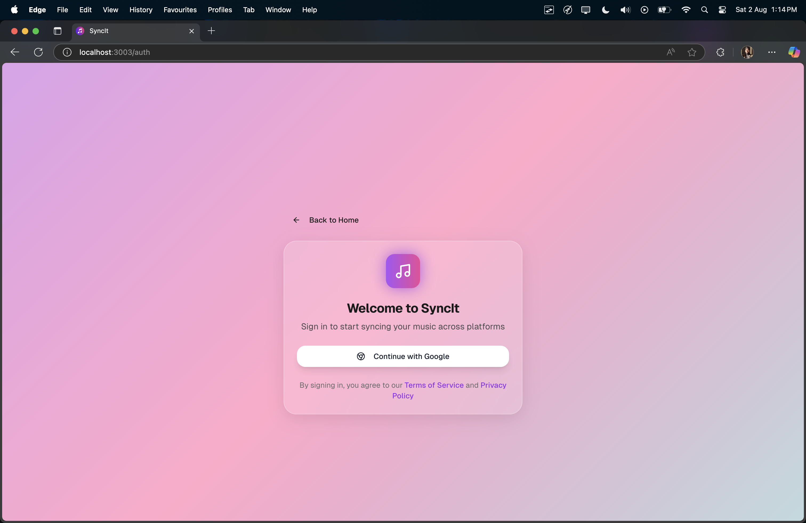
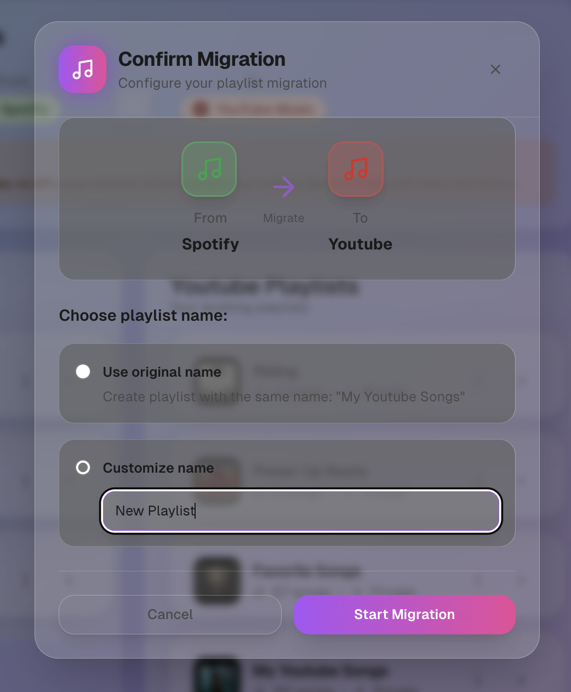
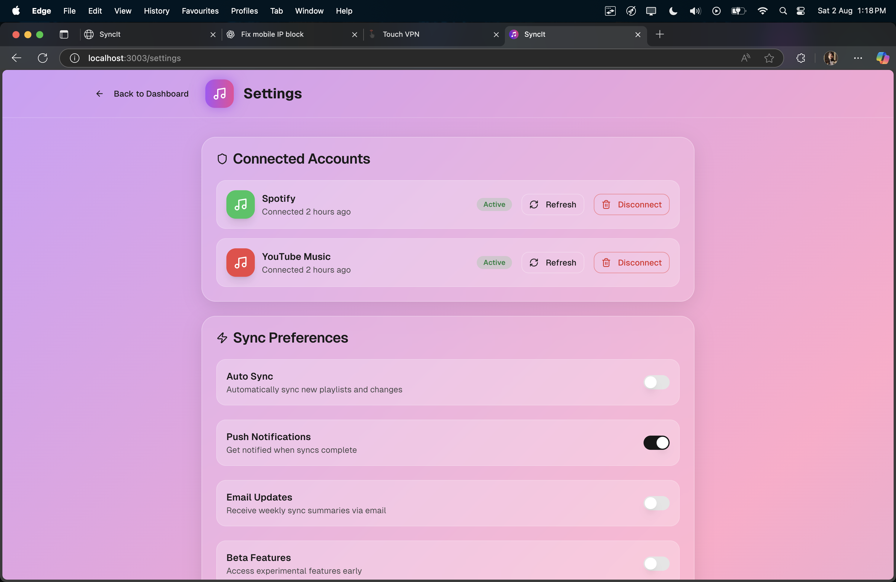

# SyncIt Client
SyncIt Client is the Next.js-based frontend for the SyncIt application, designed to provide a seamless user experience for managing and syncing liked songs across multiple music platforms, such as Spotify and YouTube. This frontend is under active development and will integrate closely with the powerful SyncIt backend, which handles authentication, API requests, data processing, and synchronization tasks efficiently.

SyncIt waitlist is live! 🚀🎵 Join now: [https://syncit.org.in/](https://syncit.org.in/) 🔥

## 📸 Screenshots

> A glimpse into the SyncIt experience — clean, fast, and built for power users.

<p align="center">
  
</p>

<table align="center">
  <tr>
    <td align="center">
      <br/>
    </td>
    <td align="center">
      <br/>
    </td>
  </tr>
</table>

<details>
<summary>▶️ View more screens</summary>

<br>








</details>

## 🚀 Features (Planned & In Development) ✨
- Modern UI/UX: Built with Next.js, Tailwind CSS, and ShadCN, ensuring a clean, responsive, and accessible interface.
- Smooth Animations: Powered by Framer Motion for interactive and dynamic UI elements.
- Cross-Platform Syncing: Interfaces with the SyncIt backend to manage and sync liked songs across different music streaming services.
- Authentication & Authorization: Secure login via OAuth for platforms like Spotify and YouTube.
- Real-Time Updates: Fetch and display live data from the backend.
- Intuitive Dashboard: A user-friendly interface to view, manage, and track synced songs.
- Extendable Architecture: Designed to allow easy integration of additional music platforms in future updates.
## Technologies Used 🛠
SyncIt Client leverages the latest technologies to ensure performance, scalability, and maintainability:
- Framework: Next.js (App Router, Server Components)
- Styling: Tailwind CSS, ShadCN
- Animations: Framer Motion
- Icons: Remix Icons, React Icons
- State Management: React Context API (for managing global state efficiently)
- API Communication: Fetching and managing data from the SyncIt backend via REST APIs.
## 📂 Project Structure
```
SyncIt-Client/
├── public/          # Static assets
├── app/             # Next.js App Router components
├── assets/          # Images, icons, and static files
├── components/      # Reusable UI components (buttons, modals, etc.)
├── pages/           # Application pages
├── constants/       # App-wide constants
├── styles/          # Global styles
├── utils/           # Utility functions
├── next.config.mjs  # Next.js configuration
├── tailwind.config.ts  # Tailwind CSS configuration
├── package.json     # Dependencies and scripts
└── README.md        # Project documentation
```


## 🛠 Installation & Development

Prerequisites - Ensure you have Node.js (>= 18) installed on your system

Clone the project
```bash
git clone https://github.com/x15sr71/Syncit-Client.git
cd Syncit-Client
```
Install Dependencies
```
npm install 
```
Run the Development Server
```
npm run dev
```
Build for Production
```
npm run build && npm run start
```
    
## 💡 About SyncIt
SyncIt is a next-generation music synchronization platform designed to seamlessly sync playlists and liked songs across multiple streaming services, including Spotify and YouTube Music. It also enables playlist migration, allowing users to transfer their curated collections between platforms effortlessly.

The SyncIt backend, built with Express.js, acts as the powerhouse of the application—handling user authentication, API requests, data processing, and synchronization tasks with efficiency and scalability.

The SyncIt Client (this repository) serves as the primary user interface, providing an intuitive and modern experience for managing synced music.

🚀 Stay tuned for updates as we continue enhancing SyncIt!!

## 🤝 Contributing

Contributions, issues, and feature requests are welcome!  
If you'd like to contribute, feel free to fork the repo and open a pull request.  
You can also open an issue to suggest improvements, report bugs, or propose new features.

Together, let’s make SyncIt even better! 🚀🎵

